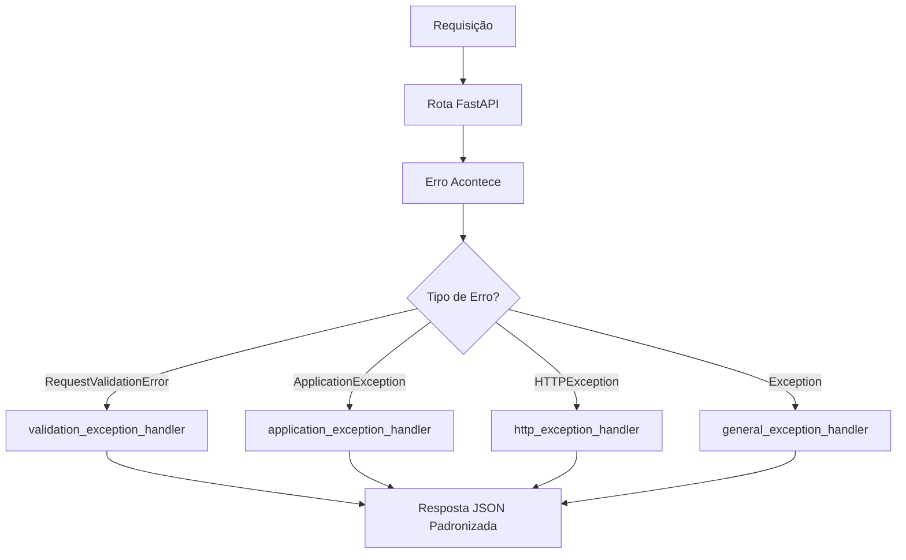

# Sistema de Tratamento de Erros - GemelliAI

Este documento descreve o sistema padronizado de tratamento de erros implementado na aplicação GemelliAI, que garante respostas consistentes e bem estruturadas para todos os tipos de erros.

## 📋 Visão Geral

O sistema intercepta automaticamente todos os erros da aplicação e os transforma em um formato JSON padronizado, proporcionando:

- **Consistência**: Todos os erros seguem o mesmo formato
- **Centralização**: Um único ponto de controle para tratamento de erros
- **Logging automático**: Todos os erros são registrados nos logs
- **Documentação automática**: OpenAPI/Swagger documenta os erros

## 🏗️ Arquitetura

### Arquivos Envolvidos

```
GemelliAI/
├── main.py                                          # Registro dos handlers
├── src/
│   ├── domain/
│   │   ├── exception/
│   │   │   └── application_exceptions.py            # Exceções customizadas
│   │   └── schema/
│   │       └── error_schemas.py                     # Schemas de resposta de erro
│   └── api/
│       ├── middleware/
│       │   └── error_handler.py                     # Handlers de tratamento
│       └── file/
│           └── docsort_router.py                    # Exemplo de uso nas rotas
```

## 📁 Detalhamento dos Arquivos

### 1. `src/domain/exception/application_exceptions.py`

Define as exceções customizadas da aplicação:

```python
class ApplicationException(Exception):
    """Exceção base para erros da aplicação"""

class ValidationException(ApplicationException):
    """Exceção para erros de validação com múltiplos campos"""

class FileFormatException(ApplicationException):
    """Exceção para formatos de arquivo inválidos"""

class TextExtractionException(ApplicationException):
    """Exceção para erros na extração de texto"""

class PathExtractionException(ApplicationException):
    """Exceção para erros na extração de path"""
```

**Características:**

- Todas herdam de `ApplicationException`
- Cada exceção tem um `title`, `status` e `detail` pré-definidos
- Suportam erros simples e de validação (com múltiplos campos)

### 2. `src/domain/schema/error_schemas.py`

Define os schemas Pydantic para as respostas de erro:

```python
class ErrorResponse(BaseModel):
    """Schema para respostas de erro simples"""
    title: str
    status: int
    detail: str

class ValidationErrorResponse(BaseModel):
    """Schema para respostas de erro de validação"""
    title: str
    status: int
    errors: Dict[str, List[str]]
```

**Função:**

- Documentam automaticamente os formatos de erro no OpenAPI/Swagger
- Garantem tipagem e validação das respostas de erro

### 3. `src/api/middleware/error_handler.py`

Contém os handlers que interceptam e transformam os erros:

```python
async def validation_exception_handler(request, exc: RequestValidationError):
    """Converte erros do Pydantic para formato padronizado"""

async def application_exception_handler(request, exc: ApplicationException):
    """Trata exceções customizadas da aplicação"""

async def http_exception_handler(request, exc: HTTPException):
    """Trata HTTPExceptions do FastAPI"""

async def general_exception_handler(request, exc: Exception):
    """Catch-all para erros não tratados"""
```

**Responsabilidades:**

- Interceptar diferentes tipos de erro
- Transformar em formato JSON padronizado
- Registrar nos logs automaticamente
- Retornar resposta JSON estruturada

### 4. `main.py`

Registra os handlers no FastAPI:

```python
# Ordem importante! Do mais específico para o mais genérico
app.add_exception_handler(RequestValidationError, validation_exception_handler)
app.add_exception_handler(ApplicationException, application_exception_handler)
app.add_exception_handler(HTTPException, http_exception_handler)
app.add_exception_handler(Exception, general_exception_handler)
```

### 5. `src/api/file/docsort_router.py` (Exemplo de uso)

Demonstra como usar as exceções customizadas nas rotas:

```python
@router.post("/docsort",
    responses={
        400: {"model": ValidationErrorResponse},
        422: {"model": ErrorResponse},
        500: {"model": ErrorResponse"}
    }
)
async def extract_path(file: UploadFile = File(...)):
    if not file.filename.endswith('.pdf'):
        raise FileFormatException("Apenas arquivos PDF são aceitos.")
```

## 🔄 Fluxo de Funcionamento

### 1. **Interceptação de Erros**



### 2. **Ordem de Precedência**

Os handlers são executados na ordem registrada (importante!):

1. **RequestValidationError** - Erros de validação do Pydantic/FastAPI
2. **ApplicationException** - Nossas exceções customizadas
3. **HTTPException** - Exceções HTTP do FastAPI
4. **Exception** - Catch-all para erros não tratados

## 📋 Formatos de Resposta

### Erro Simples

```json
{
  "title": "Application.Arquivo.FormatoInvalido",
  "status": 400,
  "detail": "Apenas arquivos PDF são aceitos."
}
```

### Erro de Validação (múltiplos campos)

```json
{
  "title": "Um ou mais erros de validação ocorreram.",
  "status": 400,
  "errors": {
    "body.file": ["O campo 'body.file' é obrigatório."],
    "body.type": ["Valor inválido para o campo 'body.type'."]
  }
}
```

## 🚀 Como Usar

### 1. **Em rotas (controllers):**

```python
from src.domain.exception.application_exceptions import FileFormatException

@router.post("/example")
async def example_route(file: UploadFile):
    if not file.filename.endswith('.pdf'):
        raise FileFormatException("Apenas arquivos PDF são aceitos.")
```

### 2. **Em services:**

```python
from src.domain.exception.application_exceptions import ValidationException

class MyService:
    def process(self, data):
        if not data:
            raise ValidationException({
                "data": ["Dados são obrigatórios para processamento."]
            })
```

### 3. **Documentando na rota:**

```python
from src.domain.schema.error_schemas import ErrorResponse, ValidationErrorResponse

@router.post("/example",
    responses={
        400: {"model": ValidationErrorResponse, "description": "Dados inválidos"},
        422: {"model": ErrorResponse, "description": "Erro de processamento"},
        500: {"model": ErrorResponse, "description": "Erro interno"}
    }
)
```

## 🛠️ Criando Novas Exceções

Para criar uma nova exceção customizada:

```python
# Em src/domain/exception/application_exceptions.py

class MyCustomException(ApplicationException):
    """Exceção para meu caso específico"""

    def __init__(self, detail: str):
        super().__init__(
            title="Application.MeuModulo.MeuErro",
            status=422,  # HTTP status code apropriado
            detail=detail
        )
```

## 📊 Logging

Todos os erros são automaticamente registrados nos logs com informações detalhadas:

```
ERROR - Application error: Application.Arquivo.FormatoInvalido - Apenas arquivos PDF são aceitos.
ERROR - Validation error: [{'type': 'missing', 'loc': ['body', 'file'], 'msg': 'Field required'}]
ERROR - HTTP error: 404 - Recurso não encontrado
ERROR - Unhandled error: ValueError - Unexpected error occurred
```

## 🎯 Benefícios

- ✅ **Consistência**: Todos os erros seguem o mesmo formato
- ✅ **Manutenibilidade**: Fácil de adicionar novos tipos de erro
- ✅ **Debugging**: Logs automáticos e detalhados
- ✅ **Documentação**: OpenAPI/Swagger automático
- ✅ **Experiência do usuário**: Mensagens de erro claras e estruturadas
- ✅ **Reutilização**: Exceções podem ser usadas em toda a aplicação

## 🔧 Troubleshooting

### Problema: Handler não está sendo executado

**Solução**: Verifique a ordem de registro no `main.py`. Handlers mais específicos devem vir antes dos genéricos.

### Problema: Erro não formatado corretamente

**Solução**: Certifique-se de que está usando as exceções customizadas (`raise FileFormatException(...)`) em vez de exceções genéricas do Python.

### Problema: Documentação OpenAPI não mostra os erros

**Solução**: Adicione os `responses` no decorador da rota com os schemas apropriados.
