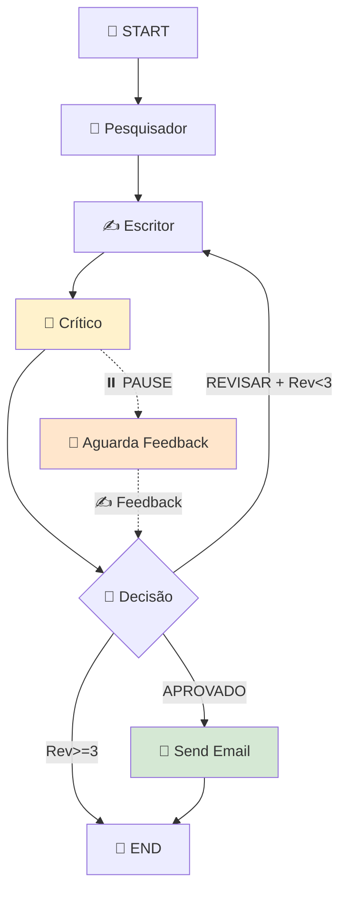

# 📋 Documentação Completa do Workflow de Criação de Artigos

## 📖 Visão Geral

Este documento explica todo o fluxo do **workflow de criação de artigos** implementado no GemelliAI usando **LangGraph** com **Clean Architecture**. O sistema cria artigos automaticamente através de pesquisa, escrita, crítica e revisão, com pausas para feedback humano.

---

## 🏗️ **Arquitetura Geral**

O sistema implementa um **workflow stateful** que:

- Pesquisa informações sobre um tópico
- Escreve um rascunho baseado na pesquisa
- Avalia criticamente o rascunho
- **Pausa para feedback humano**
- Revisa ou finaliza baseado no feedback
- Simula envio de notificação

**Tecnologias**: LangGraph, ChatGroq (Llama), FastAPI, Clean Architecture

---

## 📁 **Arquivos Envolvidos por Camada**

### **🌐 API Layer (`src/api/`)**

#### **1. `src/api/graph/graph_router.py`**

- **Função**: Endpoint HTTP principal
- **Responsabilidade**:
  - Recebe POST requests em `/api/v1/graph-chat`
  - Gerencia thread_id para conversas persistentes
  - Chama o WorkflowService
  - Retorna responses estruturadas (ChatResponse)

```python
# Endpoint principal:
@router.post("/graph-chat", response_model=ChatResponse)
async def chat_endpoint(request: ChatRequest) -> ChatResponse
```

**Request Format:**

```json
{
  "input_text": "Inteligência Artificial na Indústria",
  "thread_id": null // null para nova conversa, string para continuar
}
```

**Response Format:**

```json
{
  "thread_id": "uuid-123",
  "status": "PAUSED_FOR_HUMAN_INPUT|COMPLETED|ERROR",
  "message_to_user": "Rascunho pronto para revisão...",
  "data": { "final_article": "..." }
}
```

---

### **🧠 Application Layer (`src/application/`)**

#### **2. `src/application/service/graph/email_flow.py`**

- **Função**: Orquestrador principal do workflow
- **Responsabilidade**:
  - Compila e executa o StateGraph
  - Gerencia estado entre execuções via MemorySaver
  - Controla pausas e continuações do workflow
  - Integra todos os componentes

```python
class WorkflowService:
    def __init__(self):
        self._app = self._compile_graph()  # StateGraph compilado

    # Métodos principais:
    async def invoke_workflow(thread_id, input_data)     # Executa uma volta do workflow
    async def process_turn(thread_id, state)             # Interface para o router
    async def create_article(topic, human_feedback)      # Método de conveniência
```

**Fluxos de Execução:**

- **Nova conversa**: `app.ainvoke({"topic": "..."}, thread_config)`
- **Continuação**: `app.aupdate_state() + app.ainvoke(None, thread_config)`

---

### **📦 Domain Layer (`src/domain/`)**

#### **3. `src/domain/graph/state.py`**

- **Função**: Schema do estado compartilhado
- **Responsabilidade**: Define a estrutura de dados que flui entre todos os nós

```python
class AgentState(TypedDict):
    # Entrada
    topic: str                   # Tópico do artigo

    # Dados de trabalho
    research_summary: str        # Resultado da pesquisa
    draft: str                   # Rascunho atual
    critique: str                # Avaliação do crítico
    human_feedback: str          # Feedback do usuário
    revision_number: int         # Contador de revisões

    # Saída
    final_article: str           # Artigo finalizado
    email_sent: bool             # Flag de conclusão
    workflow_status: str         # Status geral
```

#### **4. `src/domain/graph/node.py`**

- **Função**: Implementa a lógica de cada nó do workflow
- **Responsabilidade**: Define o comportamento de cada etapa

```python
# Factory functions que retornam nós configurados:
create_researcher_node(researcher_agent_runnable) -> NodeFunction
create_writer_node(writer_runnable) -> NodeFunction
create_critic_node(critic_runnable) -> NodeFunction

# Nós de lógica pura:
send_email_node(state) -> Dict[str, Any]
decide_next_step(state) -> str  # Roteamento condicional
```

#### **5. `src/domain/graph/graph.py`**

- **Função**: Configuração e montagem do StateGraph
- **Responsabilidade**:
  - Define conexões entre nós
  - Configura pontos de interrupção
  - Define entrada e saída do grafo

```python
def create_workflow_graph() -> StateGraph:
    # Monta o grafo:
    # START → pesquisador → escritor → critico → decisão → [escritor|send_email] → END

    # Configurações importantes:
    interrupt_before=["critico"]  # Pausa antes da crítica para feedback humano
```

---

### **🔧 Infrastructure Layer (`src/infrastructure/`)**

#### **6. `src/infrastructure/llm/agent_factory.py`**

- **Função**: Factory para criação dos "cérebros" dos agentes
- **Responsabilidade**:
  - Configura instâncias do ChatGroq (Llama models)
  - Cria runnables especializados com prompts específicos
  - Gerencia ferramentas de pesquisa

```python
# LLMs configurados:
llm_fast = ChatGroq(model="llama3-8b-8192")        # Para crítica e roteamento
llm_powerful = ChatGroq(model="llama3-70b-8192")   # Para escrita principal

# Principais funções:
create_researcher_agent_executor()  # Agente com web_search + news_search tools
create_writer_runnable()            # Chain: Prompt + LLM poderoso
create_critic_runnable()            # Chain: Prompt + LLM rápido
```

#### **7. `src/infrastructure/persistence/memory_checkpointer.py`**

- **Função**: Sistema de persistência de estado
- **Responsabilidade**: Mantém estado do workflow entre execuções

```python
from langgraph.checkpoint.memory import MemorySaver
memory_saver = MemorySaver()  # Checkpointer em memória para desenvolvimento
```

#### **8. `src/infrastructure/helpers/context_manager.py`**

- **Função**: Gerenciamento de tamanho de contexto
- **Responsabilidade**: Previne erros de token limit truncando conteúdo longo

```python
def manage_workflow_context(state: AgentState) -> Dict[str, Any]:
    # Trunca research_summary, draft e critique quando muito longos
    # Mantém tamanhos: research_summary=3000, draft=4000, critique=1500 chars

def truncate_text(text: str, max_chars: int) -> str:
    # Trunca texto preservando palavras e adicionando indicador
```

#### **9. `src/agent/people/search_tools.py`**

- **Função**: Ferramentas de pesquisa para o agente pesquisador
- **Responsabilidade**: Web search e news search usando APIs externas

```python
web_search_tool   # Busca geral na web
news_search_tool  # Busca em notícias
```

---

## 🔄 **Fluxo Completo do Workflow**

### **📍 Etapa 1: Inicialização (HTTP Request)**

```
Cliente → POST /api/v1/graph-chat
Body: {
  "input_text": "Inteligência Artificial na Indústria",
  "thread_id": null
}
↓
graph_router.py recebe request
```

### **📍 Etapa 2: Preparação (Router)**

```
graph_router.py:
├── Detecta: thread_id é null (nova conversa)
├── Gera: thread_id único (UUID)
├── Prepara: input_state = {"topic": "IA na Indústria", "human_feedback": ""}
└── Chama: workflow_service.process_turn(thread_id, input_state)
```

### **📍 Etapa 3: Execução Inicial (WorkflowService)**

```
email_flow.py → WorkflowService:
├── process_turn() chama invoke_workflow()
├── Detecta: primeira mensagem (estado vazio)
├── Executa: app.ainvoke({"topic": "IA na Indústria"}, thread_config)
└── StateGraph inicia execução...
```

### **📍 Etapa 4: Nós do Workflow**

#### **🧠 Nó Pesquisador**

```
researcher_node (node.py):
├── Entrada: state["topic"] = "IA na Indústria"
├── Execução: researcher_agent_runnable.invoke({"input": topic})
│   ├── Usa: web_search_tool("IA na Indústria")
│   ├── Usa: news_search_tool("IA na Indústria")
│   └── LLM: Sintetiza informações encontradas
└── Saída: {"research_summary": "IA está revolucionando a indústria..."}
```

#### **✍️ Nó Escritor**

```
writer_node (node.py):
├── Entrada: topic + research_summary
├── Context Management: manage_workflow_context(state)
│   └── Trunca research_summary se > 3000 chars
├── Preparação: invoke_input = {topic, research_summary, draft="", critique=""}
├── Execução: writer_runnable.invoke(invoke_input)
│   ├── Prompt: "Você é um redator sênior... escreva sobre '{topic}' baseado na pesquisa..."
│   └── LLM: ChatGroq llama3-70b-8192 (modelo poderoso)
└── Saída: {"draft": "# IA na Indústria\n\nA inteligência artificial...", "revision_number": 1}
```

#### **🧐 Nó Crítico (PONTO DE INTERRUPÇÃO)**

```
critic_node (node.py):
├── Entrada: draft + human_feedback (vazio na primeira vez)
├── Context Management: manage_workflow_context(state)
├── Preparação: invoke_input = {draft, human_feedback}
├── Execução: critic_runnable.invoke(invoke_input)
│   ├── Prompt: "Você é um editor exigente... avalie este rascunho... termine com APROVADO ou REVISAR"
│   └── LLM: ChatGroq llama3-8b-8192 (modelo rápido)
├── Saída: {"critique": "O artigo está bem estruturado mas... REVISAR", "human_feedback": ""}
└── ❗ WORKFLOW PAUSADO (interrupt_before=["critico"])
```

### **📍 Etapa 5: Pausa e Response**

```
WorkflowService:
├── Workflow pausado antes do nó crítico
├── Converte resultado para dict simples
└── Retorna para router

graph_router.py:
├── Detecta: workflow pausado (não tem final_article)
├── Status: "PAUSED_FOR_HUMAN_INPUT"
├── Message: "Rascunho pronto para sua revisão. Por favor, envie seu feedback:"
└── Response: {thread_id, status, message, data: {draft: "..."}}
```

### **📍 Etapa 6: Feedback Humano**

```
Cliente → POST /api/v1/graph-chat
Body: {
  "input_text": "APROVADO",
  "thread_id": "abc-123-def"
}
↓
graph_router.py recebe feedback
```

### **📍 Etapa 7: Continuação (WorkflowService)**

```
email_flow.py → WorkflowService:
├── Detecta: thread_id existe (continuação)
├── Prepara: input_data = {"input_text": "APROVADO"}
├── Execução: invoke_workflow()
│   ├── app.aupdate_state(thread_config, {"human_feedback": "APROVADO"})
│   └── app.ainvoke(None, thread_config)  # Continua de onde parou
└── StateGraph retoma execução...
```

### **📍 Etapa 8: Decisão e Finalização**

#### **🎯 Nó de Decisão**

```
decide_next_step (node.py):
├── Entrada: state com critique atualizada
├── Análise: critique.upper() contém "APROVADO"?
├── Lógica:
│   ├── Se APROVADO → return "send_email_node"
│   ├── Se revision_number > 2 → return "__end__" (limite atingido)
│   └── Senão → return "escritor" (nova revisão)
└── Saída: "send_email_node"
```

#### **📧 Nó Final**

```
send_email_node (node.py):
├── Entrada: state completo
├── Execução: Simula envio de notificação
├── Logs: "INTENÇÃO DE NEGÓCIO: Enviar notificação sobre IA na Indústria"
└── Saída: {
    "final_article": state.draft,
    "email_sent": True,
    "workflow_status": "completed"
}
```

### **📍 Etapa 9: Response Final**

```
graph_router.py:
├── Detecta: workflow_status = "completed"
├── Status: "COMPLETED"
├── Message: "Artigo finalizado com sucesso!"
└── Response: {thread_id, status, message, data: {final_article: "..."}}
```

---

## 🔗 **Fluxo Visual do StateGraph**



---

## 📊 **Estados do Workflow**

| **Status**               | **Descrição**       | **Próxima Ação**   |
| ------------------------ | ------------------- | ------------------ |
| `IN_PROGRESS`            | Workflow executando | Aguardar conclusão |
| `PAUSED_FOR_HUMAN_INPUT` | Pausado no crítico  | Enviar feedback    |
| `COMPLETED`              | Artigo finalizado   | Workflow encerrado |
| `ERROR`                  | Erro na execução    | Verificar logs     |

---

## 🛠️ **Configurações Importantes**

### **Interrupções**

```python
interrupt_before=["critico"]  # Pausa antes do crítico aguardar feedback
```

### **Limites de Contexto**

```python
MAX_RESEARCH_CHARS = 3000    # Pesquisa truncada
MAX_DRAFT_CHARS = 4000       # Rascunho truncado
MAX_CRITIQUE_CHARS = 1500    # Crítica truncada
MAX_REVISIONS = 2            # Máximo de revisões
```

### **Modelos LLM**

```python
llm_fast = "llama3-8b-8192"      # Crítica, decisão (rápido/barato)
llm_powerful = "llama3-70b-8192"  # Escrita principal (lento/melhor)
```

---

## 📋 **Resumo das Responsabilidades**

| **Arquivo**              | **Responsabilidade**              | **Camada**     | **Tipo**        |
| ------------------------ | --------------------------------- | -------------- | --------------- |
| `graph_router.py`        | HTTP endpoints e request/response | API            | Controller      |
| `email_flow.py`          | Orquestração do workflow          | Application    | Service         |
| `state.py`               | Schema do estado compartilhado    | Domain         | Model           |
| `node.py`                | Lógica de negócio dos nós         | Domain         | Business Logic  |
| `graph.py`               | Configuração do grafo             | Domain         | Workflow Config |
| `agent_factory.py`       | Criação de LLMs e agents          | Infrastructure | Factory         |
| `memory_checkpointer.py` | Persistência do estado            | Infrastructure | Persistence     |
| `context_manager.py`     | Gestão de tamanho de contexto     | Infrastructure | Helper          |
| `search_tools.py`        | Ferramentas de pesquisa           | Infrastructure | Tools           |

---

## 🚀 **Como Testar**

### **1. Iniciar Workflow**

```bash
POST /api/v1/graph-chat
{
  "input_text": "Blockchain na Logística",
  "thread_id": null
}
```

### **2. Continuar com Feedback**

```bash
POST /api/v1/graph-chat
{
  "input_text": "APROVADO",
  "thread_id": "retornado-na-resposta-anterior"
}
```

### **3. Alternativas de Feedback**

- `"APROVADO"` → Finaliza o artigo
- `"REVISAR"` → Gera nova revisão
- `"Adicione mais exemplos práticos"` → Revisão específica

---

## 🎯 **Pontos de Extensão**

- **Novos Nós**: Adicionar validação, formatação, publicação
- **Ferramentas**: Integrar APIs de dados específicos
- **Persistência**: Trocar MemorySaver por Redis/PostgreSQL
- **Notificações**: Implementar envio real de emails/Slack
- **UI**: Interface web para acompanhar o workflow

---

Este workflow demonstra um padrão poderoso para **automação com supervisão humana**, combinando a eficiência da IA com o controle e
